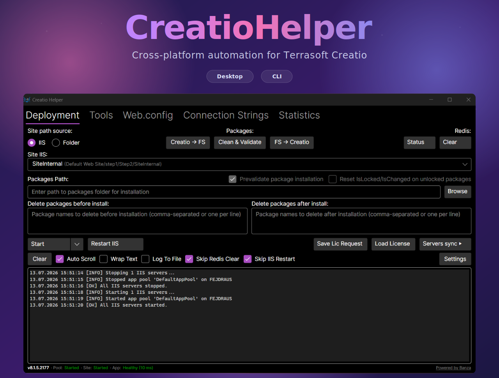

<p align="center">
  <a href="https://send.monobank.ua/jar/4vLgR4UT1p" target="_blank">
    
  </a>
</p>

<p align="center">
  <a href="https://github.com/fejdraus/CreatioHelper/releases/latest">
    
  </a>
</p>

**CreatioHelper** is a comprehensive cross-platform tool for managing Terrasoft Creatio installations. It streamlines development workflows through automation of routine operations and provides both GUI and API interfaces.

## Key Features

### Desktop Application

- **Package Installation**: Install packages into Creatio with optional cleanup
  - Delete packages before and/or after installation
  - Prevalidate packages before installation
  - Automatic reset of stale `IsLocked`/`IsChanged` flags for locked packages (SysPackage.InstallType = 1) before install — clears leftover SVN-style locks that would otherwise prevent schema updates. Optional checkbox extends the reset to unlocked (developer) packages.
- **File Design Mode**: Synchronize packages between Creatio database and filesystem
  - Download packages from Creatio DB to filesystem (Creatio → FS)
  - Upload packages from filesystem to Creatio DB (FS → Creatio)
  - Clean & Validate package sources
- **Schema Rebuild**: Regenerate and compile schema sources via WorkspaceConsole integration
- **License Management**: Generate license requests and load licenses into Creatio
- **IIS / Folder Mode**: Manage Creatio via IIS (automatic start/stop of sites and app pools) or directly via folder path without IIS
- **Redis Integration**: Check Redis status and clear cache after deployments
- **Multi-Server Synchronization**: Apply changes across multiple Creatio instances simultaneously
  - **SFTP File Copy**: Incremental rsync-style synchronization over SSH/SFTP (SSH.NET). Works from any OS to any Linux/macOS target — only changed files are transferred (size + mtime comparison). Per-server SSH credentials (password or private key). Configurable folder list per server; leave empty to sync the entire site directory.
  - **External Syncthing Integration**: Connect to external Syncthing instance via REST API
    - Real-time synchronization monitoring via Events API
    - Multi-folder support (e.g., separate folders for Terrasoft.WebApp and bin)
    - Pause/Resume folders during operations
    - Direct link to Syncthing Web UI
  - Bulk IIS management across all target servers
- **Automatic Updates**: Background check against GitHub Releases (Stable/Beta channels). On Windows downloads, replaces files and restarts in one click; on Linux/macOS opens the release page in the browser.

### Agent Service

- **HTTP API**: Remote control and monitoring of Creatio instances
- **Automation**: Scriptable deployments and operations
- **Built-in Sync** _(in development)_: Native Syncthing-inspired sync protocol implementation ([planned features](./SYNC_README.md))

### CLI (`creatio-helper-cli`)

Headless deployment automation following the same "execute what is filled in" philosophy as the Desktop app. Available for `win-x64` and `linux-x64` in every release ZIP.

```bash
creatio-helper-cli [options]                          # Run deployment
creatio-helper-cli redis-clear [options]              # Clear Redis cache
creatio-helper-cli iis start|stop|restart [options]   # Manage IIS pools/sites (Windows)
creatio-helper-cli lic load [options]                 # Load license response file into Creatio
creatio-helper-cli lic request [options]              # Save license request file from Creatio
```

**Options:**

| Flag | Description |
|------|-------------|
| `--settings <path>` | Load `AppSettings` from JSON (same format as Desktop `settings.json`) |
| `--site <path>` | Filesystem site path (overrides settings) |
| `--iis-site <name>` | IIS site name (Windows only) — auto-resolves app pool |
| `--service-name <name>` | Windows/Linux service name (Folder mode) |
| `--packages-path <path>` | Install packages from path |
| `--delete-before "A,B"` | Delete packages before installation |
| `--delete-after "A,B"` | Delete packages after installation |
| `--prevalidate true\|false` | Prevalidate before install |
| `--reset-unlocked-flags` | Also reset `IsLocked`/`IsChanged` on unlocked packages (locked are reset by default during install) |
| `--compile incremental\|full\|none` | Compile strategy (`none` skips compilation entirely — useful for file-sync-only runs) |
| `--sync none\|files\|syncthing` | Sync mode for multi-server |
| `--server "name=X,..."` | Add a target server (repeatable; if any `--server` is present, replaces the `ServerList` from `--settings`). See keys below. |
**`--server` keys:**

| Key | Required | Description |
|-----|----------|-------------|
| `name` | yes | Display name for the server (used in logs) |
| `host` | yes | SSH hostname or IP address |
| `port` | no | SSH port (default: `22`) |
| `user` | yes | SSH username |
| `pass` | one of | SSH password (use `pass` or `key`, not both) |
| `key` | one of | Path to SSH private key file (e.g. `/home/user/.ssh/id_rsa`) |
| `path` | yes | Absolute path to the Creatio site directory on the remote server |
| `service` | no | Linux service name to stop before sync and start after (leave empty to skip) |
| `sudo` | no | Set `sudo=true` to upload via `/tmp` then `sudo mv` — required when the SFTP user cannot write directly to `path` (e.g. `PermitRootLogin no` and site owned by root) |
| `owner` | no | File/directory owner to set after `sudo mv`, in `user:group` format (default: `root:root`). Only used when `sudo=true`. |

| `--sync-folders "A,B"` | Relative folder paths to sync for all servers (e.g. `"Terrasoft.Configuration"`). Overrides per-server folder list from settings. Leave empty (or omit) to sync the entire site directory. |
| `--sync-exclude "A,B"` | Comma-separated names or glob patterns to exclude from sync (e.g. `"logs,*.log,App_Data"`). Name-only patterns (no `/`) match at any depth; path patterns (with `/`) match relative to the site root. Applies to both files and directories. |
| `--no-redis-clear` | Skip Redis cache clear (useful when attaching IDE to Creatio) |
| `--no-iis-restart` | Skip IIS stop/start during compile (keeps process alive for IDE attach) |
| `--quick-install` | Skip `RebuildWorkspace` and `BuildConfiguration` after package install (faster, like clio) |
| `--no-color` | Disable ANSI colors |
| `--quiet` | Only print `[ERROR]` lines |

**`lic load` options:**

| Flag | Description |
|------|-------------|
| `--lic-file <path>` | Path to the license response file (`.lic`) |

**`lic request` options:**

| Flag | Description |
|------|-------------|
| `--destination <path>` | Directory to save the license request file |
| `--customer-id <id>` | Customer ID for the license request |
| `--file-name <name>` | Output file name (optional) |

**Examples:**

```bash
# Run a full deploy using a saved settings file
creatio-helper-cli --settings .\deploy.json

# Compile-only with no Redis clear and no IIS restart (IDE attach scenario)
creatio-helper-cli --iis-site AstanaMotors --compile incremental --no-redis-clear --no-iis-restart

# Install packages and extend the IsLocked/IsChanged reset to developer packages
creatio-helper-cli --iis-site AstanaMotors --packages-path C:\drop\pkgs --reset-unlocked-flags

# Restart IIS pool + site (no app touch)
creatio-helper-cli iis restart --iis-site AstanaMotors

# Install packages without full rebuild (faster, incremental only)
creatio-helper-cli --iis-site AstanaMotors --packages-path C:\drop\pkgs --quick-install

# Sync files to a Linux server via SFTP (skip compilation, skip Redis)
creatio-helper-cli --site /var/www/creatio --sync files --compile none --no-redis-clear \
  --server "name=PROD,host=10.0.0.5,port=22,user=deploy,pass=secret,path=/var/www/creatio,service=creatio" \
  --sync-folders "Terrasoft.Configuration"

# Same via settings file, with CLI override for a different target
creatio-helper-cli --settings deploy.json --sync files --compile none \
  --server "name=STAGING,host=10.0.0.6,port=22,user=deploy,pass=secret,path=/var/www/creatio-staging,service=creatio"

# Sync to multiple servers simultaneously
creatio-helper-cli --site /var/www/creatio --sync files --compile none --no-redis-clear \
  --server "name=SERVER1,host=10.0.0.5,port=22,user=deploy,pass=secret,path=/var/www/creatio,service=" \
  --server "name=SERVER2,host=10.0.0.6,port=22,user=deploy,pass=secret,path=/var/www/creatio,service="

# Sync files excluding logs directory and all .log files
creatio-helper-cli --site /var/www/creatio --sync files --compile none --no-redis-clear \
  --server "name=PROD,host=10.0.0.5,port=22,user=deploy,pass=secret,path=/var/www/creatio,service=creatio" \
  --sync-exclude "logs,*.log"

# Exclude a specific file inside a specific directory (path pattern with /)
creatio-helper-cli --site /var/www/creatio --sync files --compile none --no-redis-clear \
  --server "name=PROD,host=10.0.0.5,port=22,user=deploy,pass=secret,path=/var/www/creatio,service=creatio" \
  --sync-exclude "Terrasoft.WebApp/Web.config"

# Exclude multiple directories, file patterns, and a specific nested file
creatio-helper-cli --site /var/www/creatio --sync files --compile none --no-redis-clear \
  --server "name=PROD,host=10.0.0.5,port=22,user=deploy,pass=secret,path=/var/www/creatio,service=creatio" \
  --sync-exclude "logs,App_Data,*.log,*.bak,Terrasoft.WebApp/Web.config"

# Sync to Linux server where PermitRootLogin is disabled (passwordless sudo required)
# sudo=true: upload to /tmp, then sudo mv + sudo chown + sudo touch
# owner=: set file/directory owner after mv (default: root:root)
creatio-helper-cli --site C:\Site --sync files --compile none \
  --server "name=prod,host=10.0.0.1,user=croot,key=C:\Users\me\.ssh\id_rsa,path=/var/www/creatio,sudo=true,owner=root:root"
# sudoers entry (restrictive): croot ALL=(ALL) NOPASSWD: /usr/bin/mv,/usr/bin/chown,/usr/bin/touch,/usr/bin/mkdir,/usr/bin/rm

# Load a license response file
creatio-helper-cli lic load --iis-site AstanaMotors --lic-file C:\licenses\response.lic

# Save a license request file
creatio-helper-cli lic request --iis-site AstanaMotors --destination C:\licenses --customer-id 12345
```

For detailed usage instructions, see the [User Guide](./USER_GUIDE.md).

## Project Structure

All source projects are located in `src/`, and test projects in `tests/`. Main projects:

### 🧠 Business Logic and Models

- `CreatioHelper.Domain`: domain entities and enums, independent of other layers.
- `CreatioHelper.Application`: use-cases (commands and handlers via MediatR), logic interfaces.

### 🧱 Infrastructure and Shared Utilities

- `CreatioHelper.Infrastructure`: implementations of interfaces, interaction with IIS, file system, etc.
- `CreatioHelper.Shared`: utilities for file operations, logging, and configuration.
- `CreatioHelper.Contracts`: DTO classes for data exchange between Agent and other parts.

### 🖥️ UI and Services

- `CreatioHelper.Desktop`: Avalonia-based GUI application.
- `CreatioHelper.Agent`: minimal ASP.NET Core web service providing remote control API.

## Configuration

Settings are stored in memory by default and reset on each restart. To persist settings across restarts, create an empty `settings.json` file in the same folder as the executable. CreatioHelper will automatically read from and write to it.

## Build and Run

### Requirements:

- .NET 10 SDK ([https://dotnet.microsoft.com](https://dotnet.microsoft.com))
- Git
- Windows with IIS (for IIS management features, can also work in Folder Mode without IIS)
- Redis (optional, for cache management)
- [Syncthing](https://syncthing.net/) (optional, for real-time distributed file synchronization)

### Build the solution:

```bash
dotnet build CreatioHelper.sln
```

### Run GUI (Desktop):

```bash
dotnet run --project src/CreatioHelper.Desktop
```

### Run API (Agent):

```bash
dotnet run --project src/CreatioHelper.Agent
```

## Documentation

- **[User Guide](./USER_GUIDE.md)** - Complete guide for using CreatioHelper Desktop application
- **[Built-in Sync Documentation](./SYNC_README.md)** - Planned native Syncthing-inspired synchronization for Agent (in development)

## Acknowledgements

<p align="center">
  <a href="https://banzait.com/" target="_blank">
    
  </a>
</p>

Special thanks to the members of the **PeaceTeam** from **[Banza](https://banzait.com/)** for their invaluable contributions in development and testing:

- **Oleksandr**
- **Anna**
- **Roman**
- **Oleksandr**
- **Viacheslav**
- **Dasha**
- **Anton**
- **Vadym**
- **Roma**
- **Vitia**
- **Olena**
- **Vitalii**
- **Dmytro**
- **KotikSmerit**
- **Olena**
