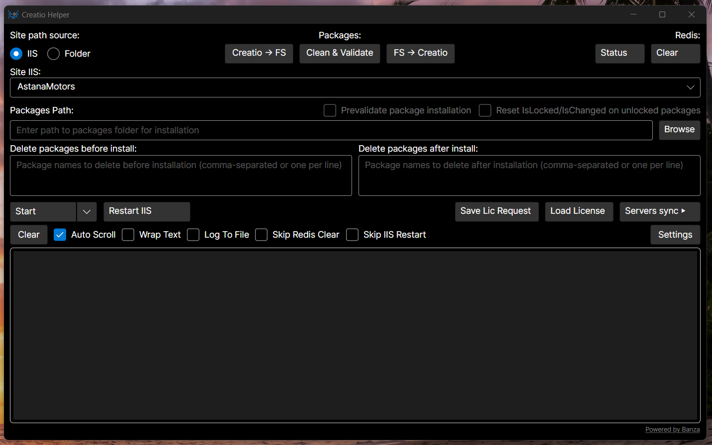

<p align="center">
  
</p>

<p align="center">
  
</p>

**CreatioHelper** is a comprehensive cross-platform tool for managing Terrasoft Creatio installations. It streamlines development workflows through automation of routine operations and provides both GUI and API interfaces.

## Key Features

### Desktop Application

- **Package Installation**: Install packages into Creatio with optional cleanup
  - Delete packages before and/or after installation
  - Prevalidate packages before installation
- **File Design Mode**: Synchronize packages between Creatio database and filesystem
  - Download packages from Creatio DB to filesystem (Creatio → FS)
  - Upload packages from filesystem to Creatio DB (FS → Creatio)
  - Clean & Validate package sources
- **Schema Rebuild**: Regenerate and compile schema sources via WorkspaceConsole integration
- **License Management**: Generate license requests and load licenses into Creatio
- **IIS / Folder Mode**: Manage Creatio via IIS (automatic start/stop of sites and app pools) or directly via folder path without IIS
- **Redis Integration**: Check Redis status and clear cache after deployments
- **Multi-Server Synchronization**: Apply changes across multiple Creatio instances simultaneously
  - Traditional file copy synchronization
  - **External Syncthing Integration**: Connect to external Syncthing instance via REST API
    - Real-time synchronization monitoring via Events API
    - Multi-folder support (e.g., separate folders for Terrasoft.WebApp and bin)
    - Pause/Resume folders during operations
    - Direct link to Syncthing Web UI
  - Bulk IIS management across all target servers
- **Automatic Updates**: Background check against GitHub Releases (Stable/Beta channels). On Windows downloads, replaces files and restarts in one click; on Linux/macOS opens the release page in the browser.

### Agent Service

- **HTTP API**: Remote control and monitoring of Creatio instances
- **Automation**: Scriptable deployments and operations
- **Built-in Sync** _(in development)_: Native Syncthing-inspired sync protocol implementation ([planned features](./SYNC_README.md))

For detailed usage instructions, see the [User Guide](./USER_GUIDE.md).

## Project Structure

All source projects are located in `src/`, and test projects in `tests/`. Main projects:

### 🧠 Business Logic and Models

- `CreatioHelper.Domain`: domain entities and enums, independent of other layers.
- `CreatioHelper.Application`: use-cases (commands and handlers via MediatR), logic interfaces.

### 🧱 Infrastructure and Shared Utilities

- `CreatioHelper.Infrastructure`: implementations of interfaces, interaction with IIS, file system, etc.
- `CreatioHelper.Shared`: utilities for file operations, logging, and configuration.
- `CreatioHelper.Contracts`: DTO classes for data exchange between Agent and other parts.

### 🖥️ UI and Services

- `CreatioHelper.Desktop`: Avalonia-based GUI application.
- `CreatioHelper.Agent`: minimal ASP.NET Core web service providing remote control API.

## Build and Run

### Requirements:

- .NET 10 SDK ([https://dotnet.microsoft.com](https://dotnet.microsoft.com))
- Git
- Windows with IIS (for IIS management features, can also work in Folder Mode without IIS)
- Redis (optional, for cache management)
- [Syncthing](https://syncthing.net/) (optional, for real-time distributed file synchronization)

### Build the solution:

```bash
dotnet build CreatioHelper.sln
```

### Run GUI (Desktop):

```bash
dotnet run --project src/CreatioHelper.Desktop
```

### Run API (Agent):

```bash
dotnet run --project src/CreatioHelper.Agent
```

## CI/CD

Build and release pipelines are configured with GitHub Actions:

- `release.yml` — **Stable**. Auto-runs on push to `main` when `<Version>` in `src/CreatioHelper.Desktop/CreatioHelper.csproj` changes; creates tag `vX.Y.Z` and a non-prerelease GitHub Release with `win-x64` and `linux-x64` ZIPs.
- `beta.yml` — **Beta**. Manual via `workflow_dispatch` from any branch; produces prerelease tag `vX.Y.Z-beta.<run_number>` and Release flagged as `prerelease`.
- `_build.yml` — Reusable workflow called by both. Runs the `win-x64` + `linux-x64` matrix, builds self-contained single-file artifacts with native libs bundled and ReadyToRun pre-compilation enabled, then publishes the Release.

The Desktop application is built with Avalonia, providing true cross-platform support for Windows, Linux, and macOS.

## Testing

Testing is done using `xUnit`, `Moq`, and `coverlet`:

- `tests/CreatioHelper.Tests`: unit tests for business logic, utilities, and infrastructure.
- `tests/CreatioHelper.Agent.Tests`: unit tests for Agent API controllers.

Run tests:

```bash
dotnet test
```

## Architecture

The project follows Clean Architecture principles:

- `Domain` — models and business logic without dependencies.
- `Application` — use-case interfaces and commands.
- `Infrastructure` — implementation of external integrations.
- `Desktop` and `Agent` — UI and API clients.

## Documentation

- **[User Guide](./USER_GUIDE.md)** - Complete guide for using CreatioHelper Desktop application
- **[Built-in Sync Documentation](./SYNC_README.md)** - Planned native Syncthing-inspired synchronization for Agent (in development)

## Acknowledgements

Special thanks to the members of the **PeaceTeam** from **Banza** for their invaluable contributions in development and testing:

- **Oleksandr**
- **Anna**
- **Roman**
- **Oleksandr**
- **Viacheslav**
- **Dasha**
- **Anton**
- **Vadym**
- **Roma**
- **Vitia**
- **Olena**
- **Vitalii**
- **Dmytro**
- **KotikSmerit**
- **Olena**

---

##  Support the Armed Forces of Ukraine (ZSU)

We stand with Ukraine in its fight against Russian aggression.
All funds raised via Monobank below will be **fully transferred to support the Armed Forces of Ukraine (Zbroini Syly Ukrainy, ZSU)** — specifically to help defenders **repair and purchase FPV drones** for the front line.

[](https://send.monobank.ua/jar/4vLgR4UT1p)

> 💙💛 **All contributions will be sent directly to support ZSU defenders.**

**Glory to Ukraine! Glory to the Heroes!** 
